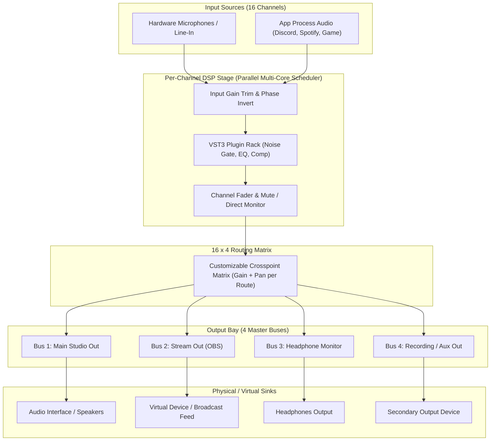

# DSD Mixer 🎚️

[](https://microsoft.com)
[-orange.svg)](https://juce.com)
[](LICENSE)
[]()
[-purple.svg)]()

**DSD Mixer** adalah konsol virtual mixer audio digital *ultra-low latency* untuk Windows x64 yang dirancang khusus untuk keperluan **Live Streaming, Podcasting, Game Audio Routing, dan Broadcast Production**. 

Terinspirasi dari tata letak dan keandalan konsol broadcast profesional kelas atas (seperti DHD Audio RX2 / SX2), DSD Mixer menggabungkan fleksibilitas penangkapan audio per-aplikasi (OBS-style Process Audio Capture), hosting plugin efek VST3 native, perutean fleksibel matriks 16x4, serta penjadwalan pemrosesan paralel multi-core yang adaptif.

---

## 📑 Daftar Isi

- [Fitur Utama](#-fitur-utama)
  - [1. 16 Kanal Input & Strip Konsol Modern](#1-16-kanal-input--strip-konsol-modern)
  - [2. Per-Process Window Audio Capture (OBS-Style)](#2-per-process-window-audio-capture-obs-style)
  - [3. Matriks Perutean Broadcast 16x4 (Routing Matrix)](#3-matriks-perutean-broadcast-16x4-routing-matrix)
  - [4. Output Bay & Multi-Device Routing](#4-output-bay--multi-device-routing)
  - [5. Native VST3 Plugin Rack](#5-native-vst3-plugin-rack)
  - [6. Adaptive Multi-Core DSP Scheduler](#6-adaptive-multi-core-dsp-scheduler)
  - [7. Diagnostik & Telemetri Real-Time](#7-diagnostik--telemetri-real-time)
  - [8. Manajemen Sesi & Preset](#8-manajemen-sesi--preset)
- [Diagram Alur Sinyal (Signal Flow)](#-diagram-alur-sinyal-signal-flow)
- [Kebutuhan Sistem (System Requirements)](#-kebutuhan-sistem-system-requirements)
- [Cara Menjalankan (Quick Start)](#-cara-menjalankan-quick-start)
- [Panduan Penggunaan Cepat](#-panduan-penggunaan-cepat)
- [Membangun dari Kode Sumber (Build from Source)](#-membangun-dari-kode-sumber-build-from-source)
- [Lisensi](#-lisensi)

---

## ✨ Fitur Utama

### 1. 16 Kanal Input & Strip Konsol Modern
- **16 Kanal Input Independen**: Mendukung campuran antara mikrofon/alat musik fisik dan audio perangkat lunak Windows.
- **OLED Style Channel Display**:
  - Badge nomor dan nama kanal yang dapat disesuaikan (*Custom Channel Label*).
  - Pembacaan gain digital berpresisi tinggi.
  - Metering stereo dBFS real-time dengan respons RMS dan Peak-Hold.
- **Tombol Utilitas Kanal**:
  - **`VST`**: Membuka rak efek VST3 per-kanal.
  - **`DM` (Direct Monitor)**: Memantau sinyal mentah kanal tanpa delay pemrosesan.
  - **`PH` (Phase Invert)**: Membalik fase sinyal 180° untuk menghindari pembatalan fase pada konfigurasi multi-mic.
  - **`MONO`**: Menjumlahkan sinyal stereo menjadi mono.
- **Broadcast Fader & Tombol ON/OFF Taktil**: Fader panjang (-60 dB hingga +12 dB) dengan tombol `ON` dan `OFF` (Mute) bergaya konsol siaran radio.

---

### 2. Per-Process Window Audio Capture (OBS-Style)
DSD Mixer memiliki kemampuan untuk mengisolasi dan menangkap aliran audio langsung dari proses aplikasi Windows tertentu menggunakan Windows Core Audio (WASAPI Process Loopback):
- **Isolasi Audio Murni**: Tangkap suara Spotify, Discord, Game, Chrome, atau DAW secara terpisah tanpa perlu Virtual Audio Cable tambahan.
- **Low-Latency Ring Buffer (`LowLatencyCaptureFifo`)**:
  - **Clock-Drift Compensation (PPM)**: Mengukur selisih frekuensi clock antar-perangkat secara real-time dan melakukan *micro-steering* halus tanpa distorsi klik atau *pop*.
  - **Dynamic Backlog Flushing**: Mencegah penumpukan latensi saat aplikasi target mengalami lag atau buffer burst.
  - **Resampling Otomatis**: Dilengkapi *Lagrange Interpolator* stereo untuk menyelaraskan *sample rate* aplikasi sumber ke engine DSD Mixer secara mulus.
- **Profil Latensi Siap Pakai**:
  - **Ultra-Low**: Bantalan buffer ~3–5 ms (ideal untuk gaming kompetitif atau live monitoring instan).
  - **Low (Default)**: Bantalan buffer ~7–8 ms (keseimbangan optimal antara kestabilan dan latensi rendah).
  - **Standard**: Bantalan buffer ~15 ms (toleransi jitter tinggi untuk PC dengan beban berat).

---

### 3. Matriks Perutean Broadcast 16x4 (Routing Matrix)
Perutean fleksibel tingkat lanjut menghubungkan setiap kanal masukan ke 4 bus keluaran:
- **Tampilan Kisi Interaktif (16x4 Grid Canvas)**: Klik untuk mengaktifkan atau mematikan persimpangan (*crosspoint*) antara kanal 1–16 ke Bus Output 1–4.
- **Broadcast Inspector Bar**:
  - Pengaturan Gain Send independen per titik potong (-60 dB hingga +12 dB).
  - Pengaturan Panning independen per persimpangan.
  - Tombol pintas `0 dB` reset dan toggle `Disconnect`.
- **Tombol Routing Cepat**:
  - **1:1 Default**: Merutekan kanal 1 ke Bus 1, kanal 2 ke Bus 2, dst.
  - **All to Main**: Mengarahkan seluruh 16 kanal langsung ke Master Output (Bus 1).
  - **Clear All**: Memutus semua rute seketika.
- **Manajemen Preset Routing (`.dsdroute`)**: Simpan dan muat konfigurasi matriks perutean Anda untuk berbagai skenario (misalnya: Skenario Streaming, Podcasting Multi-Host, atau Gaming).

---

### 4. Output Bay & Multi-Device Routing
- **4 Bus Output Terpisah**: Secara default dialokasikan untuk:
  1. **Master / Main Out**: Keluaran ke speaker studio atau monitor utama.
  2. **Stream Out**: Campuran audio yang dikirim ke OBS / software streaming.
  3. **Phones / Monitor**: Keluaran khusus headphone dengan kontrol monitor mandiri.
  4. **Record / Aux Out**: Jalur cadangan untuk rekaman multitrack atau interkom.
- **Dukungan Multi-Device Simultan**: Setiap bus output dapat dialokasikan ke perangkat audio fisik Windows yang berbeda (misalnya: Bus 1 ke USB Audio Interface, Bus 2 ke Virtual Cable, Bus 3 ke Headphone Jack 3.5mm).
- **Kontrol Penuh per Bus**: Setiap bus output dilengkapi fader master independen, meter stereo resolusi tinggi, tombol `MUTE`, dan tombol `MON` (Monitor).

---

### 5. Native VST3 Plugin Rack
Sempurnakan suara mikrofon atau musik Anda secara langsung di dalam mixer:
- **Dukungan VST3 64-bit**: Pasang plugin favorit Anda seperti Noise Suppressor, EQ parametrik, Kompresor, De-Esser, Limiter, Auto-Tune, hingga Reverb.
- **Manajemen Slot Plugin**: Tambah, hapus, susun ulang (reorder), serta *bypass* plugin secara instan.
- **Native GUI Editor**: Klik pada nama plugin untuk memunculkan antarmuka visual asli dari plugin tersebut.
- **Crash Protection (Dead Man's Pedal)**: Mendeteksi kegagalan plugin saat pemindaian (*scanning*) agar tidak merusak sesi audio mixer secara keseluruhan.
- **Automatic Latency Tracking**: Melaporkan latensi pemrosesan plugin untuk kompensasi sinkronisasi audio.

---

### 6. Adaptive Multi-Core DSP Scheduler
Dirancang untuk efisiensi komputasi ekstrem pada sistem multi-core modern:
- **Paralelisasi Bebas Kunci (Lock-Free Multi-Threading)**: Memproses DSP tiap kanal secara simultan menggunakan *thread pool* pekerja (2 hingga 8 core).
- **Skalabilitas Adaptif (Adaptive Scaling)**: Sistem secara otomatis menambah atau mengurangi pekerja aktif berdasarkan batas waktu (*deadline budget*) buffer audio dan beban CPU.
- **Stabilitas Real-Time**: Bebas dari alokasi memori dinamis di dalam *audio callback loop* untuk mencegah *audio dropouts* (anti-glitch).

---

### 7. Diagnostik & Telemetri Real-Time
Pantau kondisi sistem mixer Anda secara transparan:
- **Performance Monitor Dialog**:
  - Persentase beban CPU Proses dan beban DSP Engine.
  - Waktu eksekusi DSP vs. Sisa Headroom vs. Batas Waktu (*Deadline Buffer*).
  - Penghitung *Deadline Miss*, *Buffer Overrun*, dan *XRun / Glitch*.
  - Visualisasi beban kerja masing-masing *Worker Thread* secara terpisah.
- **Stage Inspector Dialog**:
  - Inspeksi rantai sinyal pada 5 titik kritis kanal:
    1. `Stage A` - Input (Sinyal mentah masuk)
    2. `Stage B` - Post-Gain (Setelah trim gain)
    3. `Stage C` - Post-VST (Setelah efek plugin)
    4. `Stage D` - Post-Fader (Setelah fader volume kanal)
    5. `Stage E` - Output Bus (Setelah penjumlahan matriks)
  - Indikator peringatan *Clipping* instan di tiap tahap.

---

### 8. Manajemen Sesi & Preset
- **Simpan & Muat Sesi Penuh (`.dsd`)**: Simpan seluruh tata letak mixer, status fader, nama kanal, perutean matriks, dan konfigurasi plugin VST3 ke dalam satu file sesi.
- **Ekspor/Impor Cepat**: Simpan preset routing khusus untuk beralih mode siaran hanya dalam hitungan detik.

---

## 🔄 Diagram Alur Sinyal (Signal Flow)



---

## 💻 Kebutuhan Sistem (System Requirements)

| Komponen | Spesifikasi Minimum | Rekomendasi |
| :--- | :--- | :--- |
| **Sistem Operasi** | Windows 10 x64 (Versi 2004 atau lebih baru) | Windows 11 64-bit |
| **Prosesor (CPU)** | Intel Core i3 / AMD Ryzen 3 (Dual-Core) | Intel Core i5/i7 atau AMD Ryzen 5/7 (4-Core ke atas) |
| **RAM** | 4 GB | 8 GB atau lebih besar |
| **Penyimpanan** | 20 MB ruang kosong | SSD dengan ruang kosong memadai untuk VST3 |
| **Driver Audio** | Windows Audio (WASAPI) bawaan | Audio Interface dengan latensi rendah |
| **Runtime Tambahan**| [Microsoft Visual C++ Redistributable (x64)](https://aka.ms/vs/17/release/vc_redist.x64.exe) | Sudah terpasang di hampir seluruh Windows modern |

---

## 🚀 Cara Menjalankan (Quick Start)

DSD Mixer didistribusikan sebagai **Single Portable Binary**:
1. Unduh rilis terbaru dari tab [GitHub Releases](https://github.com/AiChan277/DSD-mixer/releases).
2. Ekstrak atau salin file `DSD Mixer.exe` ke direktori pilihan Anda (misalnya `C:\Program Files\DSD Mixer\` atau folder utilitas Anda).
3. Klik ganda `DSD Mixer.exe` untuk menjalankannya langsung tanpa instalasi!

> [!TIP]
> Anda dapat membuat pintasan (*shortcut*) `DSD Mixer.exe` ke Desktop atau Taskbar untuk kemudahan akses.

---

## 🎙️ Panduan Penggunaan Cepat

### 1. Menyiapkan Perangkat Audio Utama
- Di bagian atas jendela aplikasi (**Top Bar**), klik tombol **`AUDIO DEVICE`**.
- Pilih driver (WASAPI) dan tentukan perangkat keluaran utama (*Output Device*) serta masukan mikrofon (*Input Device*).
- Pilih ukuran buffer (disarankan **128** atau **256 sampel** pada sample rate **48.000 Hz** untuk latensi rendah).

### 2. Menangkap Audio dari Aplikasi Tertentu (Misal: Spotify / Discord / Game)
1. Pilih kanal yang ingin Anda gunakan (misal: Kanal 3).
2. Di bagian atas strip kanal tersebut, klik menu *dropdown* sumber masukan.
3. Daftar aplikasi yang sedang berjalan akan ditampilkan otomatis. Pilih aplikasi yang ingin ditangkap (misal `Spotify.exe` atau `Discord.exe`).
4. Suara dari aplikasi tersebut kini langsung masuk secara eksklusif ke fader kanal tersebut!

### 3. Merutekan Suara ke Headphone & Stream
1. Klik tombol **`ROUTING MATRIX`** di Top Bar.
2. Centang kotak persimpangan antara kanal mikrofon/aplikasi Anda dengan Bus 1 (Main/Monitor) dan Bus 2 (Stream).
3. Sesuaikan *send gain* di bilah inspektor jika ingin suara game di headphone lebih kencang dibanding suara yang masuk ke siaran stream.

### 4. Menambahkan Efek Suara (VST3)
1. Pada strip kanal yang diinginkan, klik tombol **`VST`**.
2. Klik **`+ ADD PLUGIN`**, lalu pilih plugin VST3 dari sistem Anda.
3. Klik nama plugin untuk membuka antarmuka grafisnya dan lakukan *tuning* audio sesuai kebutuhan.

---

## 🛠️ Membangun dari Kode Sumber (Build from Source)

Jika Anda ingin memodifikasi kode sumber atau melakukan kompilasi mandiri:

### Prasyarat:
- **Visual Studio 2022 Build Tools** (dengan komponen *C++ Desktop Development* & *MSVC v143*).
- **CMake** (minimal versi 3.22).
- **Ninja Build System** (opsional, disarankan untuk kecepatan build).
- **Git** (dengan modul JUCE yang telah disubmodule).

### Langkah Kompilasi Cepat (Menggunakan Script):
Cukup jalankan script batch yang tersedia di terminal:
```cmd
build.bat
```
Script ini akan:
1. Memuat *environment* MSVC x64 secara otomatis.
2. Menjalankan konfigurasi CMake berbasis Ninja dalam mode `Release`.
3. Mengompilasi `DSD Mixer.exe` dan menyimpannya di folder:
   `build\DSDMixer_artefacts\Release\DSD Mixer.exe`

### Langkah Kompilasi Manual (CMake CLI):
```powershell
# 1. Konfigurasi direktori build
cmake -B build -G "Ninja" -DCMAKE_BUILD_TYPE=Release

# 2. Eksekusi kompilasi
cmake --build build --config Release -j 4
```

### Menjalankan Automated Unit Tests:
DSD Mixer dilengkapi dengan rangkaian pengujian unit otomatis untuk menguji kestabilan perutean matriks 16x4 dan alur DSP:
```powershell
cmake --build build --target AudioEngineTests --config Release
.\build\AudioEngineTests_artefacts\Release\AudioEngineTests.exe
```

---

## 📄 Lisensi

Proyek ini dirilis di bawah lisensi terbuka [MIT License](LICENSE).  
Copyright (c) 2026 Rachel. Bebas digunakan, dipelajari, dimodifikasi, dan didistribusikan.
