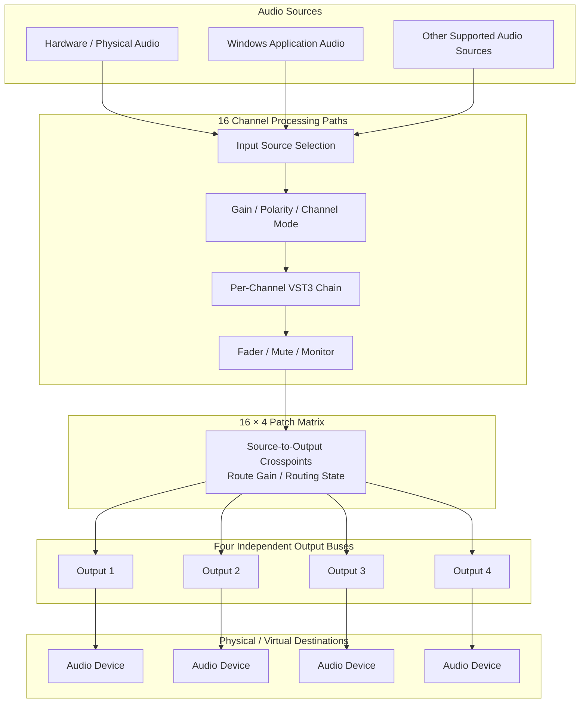

# DSD Mixer

[](https://microsoft.com)
[](https://juce.com)
[](LICENSE)
[]()
[]()

**DSD Mixer** is a software-defined, real-time digital audio mixing console for Windows x64. Level 1 provides **16 input channels and 4 independent output buses**, with per-channel DSP, native VST3 processing, application audio capture, configurable patch-based routing, and an adaptive multi-core processing engine.

DSD Mixer is designed for workflows such as **live streaming, podcasting, broadcast production, software audio routing, live monitoring, and general-purpose real-time audio control**. It is deliberately designed as a mixer and routing system rather than a digital audio workstation (DAW): the signal path is continuous, deterministic, and centred on real-time processing and routing rather than timeline-based production.

---

## What Does DSD Mean?

**DSD** stands for **Digital Sustained Design**.

The name describes the design philosophy behind the project rather than a particular audio format or protocol. DSD Mixer treats the audio system as a **continuously operating digital signal-processing system** whose components should remain modular, predictable, and maintainable as the system grows.

The word **Digital** reflects the software-defined nature of the console: sources, processing stages, routing relationships, buses, and outputs are represented and controlled in software rather than being tied to a fixed physical console architecture.

**Sustained** reflects the requirement for the system to operate continuously under real-time constraints. Audio processing is therefore designed around bounded work, predictable buffer deadlines, persistent worker infrastructure, pre-allocated processing resources, and explicit performance telemetry rather than short-lived batch processing.

**Design** refers to the architecture itself. DSD Mixer is intended to provide a reusable signal-processing and routing framework in which channels, DSP stages, buses, and destinations can be composed without imposing unnecessary restrictions on what a channel is allowed to carry.

In practical terms, this means that a channel is not inherently a “microphone channel”, “game channel”, or “music channel”. A channel is a processing path to which a suitable source can be assigned.

> **DSD Mixer is built around the idea of sustained, software-defined signal-path design.**

---

## Design Philosophy

DSD Mixer follows a **channel-centric, patch-oriented** model.

A conventional creator mixer may present routing primarily as a collection of predefined mixes. DSD Mixer instead treats the relationship between a source and a destination as a first-class **patch**. The Routing Matrix therefore represents a configurable set of source-to-destination relationships rather than a fixed collection of named mixes.

For Level 1, the matrix provides:

- **16 input channels**
- **4 independent output buses**
- **64 possible channel-to-output crosspoints**
- Independent route activation and send gain
- Optional per-route panning where supported by the routing implementation

This makes common “multiple mix” workflows possible without making the concept of a mix the fundamental abstraction. A source may be patched to one output, several outputs, or none, with different send levels for each destination.

The resulting signal model is approximately:

```text
Audio Source
     │
     ▼
 Input / Channel
     │
     ├── Input Gain / Polarity / Channel Mode
     │
     ├── VST3 Processing Chain
     │
     ├── Channel Fader / Mute / Monitor
     │
     ▼
 Routing / Patch Matrix
     │
     ├── Output 1
     ├── Output 2
     ├── Output 3
     └── Output 4
```

The architecture is intended to remain extensible towards buses, submixes, output processing, and additional signal-graph stages without changing the basic channel abstraction.

---

## Features

### 1. 16 Independent Input Channels

DSD Mixer Level 1 provides **16 independently configurable channel strips**.

A channel does not impose a particular source type. The same channel architecture can be used for a physical microphone, line input, application audio, virtual audio, or another supported source.

Each channel provides:

- Configurable source selection
- Custom channel identification and labelling
- Input gain control
- Real-time dBFS metering
- Peak and RMS-oriented monitoring information
- Peak-hold and clipping indication
- Channel fader
- Channel ON/OFF control
- Mono summing
- Polarity inversion
- Direct-monitor control where supported by the active signal path
- Independent VST3 processing
- Independent routing to the output matrix

This source-agnostic design allows configurations such as:

```text
CH01 → Microphone
CH02 → Microphone
CH03 → Brave / Browser Audio
CH04 → MP3 / Media
CH05 → Game Audio
CH06 → Discord
...
CH16 → Microphone
```

There is no requirement for all 16 channels to use the same source class.

---

### 2. Windows Application Audio Capture

DSD Mixer can capture audio from individual Windows application processes through **WASAPI Process Loopback**.

This allows supported applications to be treated as mixer sources without requiring a separate virtual audio cable for every application.

Typical use cases include capturing audio from:

- Web browsers
- Discord
- Games
- Music players
- Media applications
- Other Windows applications exposing audio through the Windows Core Audio system

The captured application stream enters DSD as a normal channel source. Once assigned, it can use the same gain, DSP, fader, metering, and routing facilities as a hardware input.

The capture path includes a dedicated low-latency FIFO designed to manage the practical problems of application audio delivery, including:

- Bounded buffering
- Buffer-burst handling
- Backlog management
- Clock-drift measurement and compensation
- Sample-rate alignment through resampling where required

The objective is not simply to capture application audio, but to integrate it into the same real-time signal-processing architecture as the rest of the console.

---

### 3. 16 × 4 Patch Routing Matrix

The **Routing Matrix** is the central routing facility of DSD Mixer Level 1.

Rather than treating a “mix” as the primary routing object, DSD exposes the individual **source-to-destination patch relationships** directly.

The matrix provides:

- A **16 × 4 interactive crosspoint grid**
- 16 source/channel rows
- 4 output destinations
- Up to **64 independent patch relationships**
- Per-route connection state
- Independent send gain for each active route
- Route inspection and disconnection controls
- Routing presets for repeatable configurations

For example:

```text
CH01 → OUT1  0.0 dB
CH01 → OUT2 -6.0 dB
CH01 → OUT3 -12.0 dB
```

The same channel can therefore feed several destinations without requiring duplicate channel strips.

Available routing presets include:

- **1:1 Default** — establishes a direct channel-to-output mapping
- **All to Main** — patches all available channels to the main output
- **Clear All** — removes all active patches

Routing configurations can also be saved and restored as dedicated `.dsdroute` presets.

---

### 4. Independent Output Bay

The output section provides **four independent output buses**.

Outputs are deliberately treated as destinations rather than hard-coded roles. A user may assign semantic labels such as:

```text
OUT 1 → MAIN
OUT 2 → BUS 1
OUT 3 → BUS 2
OUT 4 → RECORDING
```

These labels describe the user's workflow; the underlying engine continues to operate on Output Bus 1–4.

Each output provides its own:

- Output-device assignment
- User-defined label
- Stereo metering
- Master fader
- Mute control
- Monitor control

Where supported by the configured audio system, different output buses can be associated with different physical or virtual Windows audio devices. This allows workflows such as:

```text
OUT1 → Studio monitors
OUT2 → Streaming / broadcast feed
OUT3 → Headphones
OUT4 → Recording / auxiliary destination
```

The output bay remains visually fixed while the channel area can be navigated horizontally, preserving access to the final output stage even when many channel strips are displayed.

---

### 5. Per-Channel Native VST3 Processing

Each channel can host its own **VST3 processing chain**.

This allows different sources to have different processing requirements without forcing a single global effects chain.

A typical voice-processing chain might be:

```text
Noise Gate
    ↓
EQ
    ↓
Compressor
    ↓
De-Esser
    ↓
Limiter
```

Other channels can use a completely different chain, or no plugins at all.

The VST3 system provides:

- Native 64-bit VST3 plugin support
- Per-channel plugin chains
- Plugin insertion and removal
- Plugin reordering
- Plugin bypass
- Native plugin editor windows where provided by the plugin
- Plugin latency reporting/tracking where available
- Isolation of plugin-scanning failures so that a problematic plugin does not unnecessarily compromise the entire mixer

Because plugins are attached to channels rather than to a global mixer state, the processing architecture remains consistent with DSD's channel-centric design.

---

### 6. Adaptive Multi-Core DSP Scheduler

DSD Mixer is designed for modern multi-core processors and treats channel DSP as a collection of real-time processing tasks rather than permanently binding one CPU core to one channel.

The engine uses a persistent worker architecture in which independent channel-processing tasks can be executed concurrently. This allows the available processing capacity to be used according to the actual workload.

Key principles include:

- Persistent worker threads rather than repeatedly creating and destroying threads
- Parallel processing of independent channel DSP stages
- Dependency-aware processing for later stages such as buses and master paths
- Adaptive worker utilisation based on workload and audio deadlines
- Real-time-safe processing practices
- Avoidance of unnecessary dynamic allocation inside the audio callback
- Pre-allocated audio buffers and synchronisation structures where practical

The processing model can be represented as:

```text
Phase 1: Independent Channels
          ├── CH01 DSP
          ├── CH02 DSP
          ├── CH03 DSP
          └── ... CH16 DSP
                 │
                 ▼
Phase 2: Bus / Routing Processing
                 │
                 ▼
Phase 3: Master Processing
                 │
                 ▼
Phase 4: Output Processing
```

This approach allows additional channels or processing stages to increase computational workload without requiring a permanently fixed core-to-channel relationship.

---

### 7. Real-Time Performance Monitoring

DSD Mixer exposes its real-time processing behaviour through a dedicated performance monitor.

The diagnostics distinguish between general process utilisation and the actual audio-processing deadline.

The performance view can report information including:

- Process CPU utilisation
- DSP engine load
- DSP processing time
- Audio buffer duration / deadline
- Remaining DSP headroom
- Active worker count
- Worker workload information
- Deadline misses
- Buffer overruns
- XRuns / glitches
- Plugin latency information where available

A useful measure of DSP load is:

```text
DSP Load = DSP Processing Time / DSP Deadline × 100%
```

This distinction is important because a low overall CPU percentage does not automatically mean that an audio engine is meeting its real-time deadline. DSD therefore treats **deadline compliance and CPU utilisation as separate measurements**.

---

### 8. Signal-Stage Inspection

DSD Mixer provides stage-oriented inspection of the signal path so that processing problems can be located rather than inferred from a single output meter.

The conceptual processing stages are:

```text
Stage A — Input
Stage B — Post-Gain
Stage C — Post-VST
Stage D — Post-Fader
Stage E — Output Bus
```

Stage inspection can be used to determine where level changes, clipping, or other signal-path behaviour occurs.

This is particularly useful when a channel contains several processing stages or when the same source is routed to multiple destinations.

---

### 9. Session and Routing Presets

DSD Mixer supports persistent configuration for repeatable workflows.

A `.dsd` session can contain mixer state such as:

- Channel configuration
- Channel labels
- Source assignments
- Fader states
- Routing configuration
- Output configuration
- VST3 plugin configuration/state where supported

Dedicated routing presets (`.dsdroute`) allow routing arrangements to be stored independently of the complete mixer session.

This makes it possible to maintain separate configurations for activities such as streaming, podcasting, live monitoring, testing, or other recurring setups.

---

## Signal Flow

The Level 1 architecture can be represented as follows:



The implementation is intended to evolve towards a more general signal graph in which additional processing nodes and buses can be introduced while retaining the same real-time scheduling principles.

---

## System Requirements

| Component | Minimum | Recommended |
| :--- | :--- | :--- |
| **Operating System** | Windows 10 x64, version 2004 or later | Windows 11 64-bit |
| **CPU** | Intel Core i3 / AMD Ryzen 3 or equivalent | Intel Core i5/i7 or AMD Ryzen 5/7 and above |
| **Memory** | 4 GB RAM | 8 GB RAM or more |
| **Storage** | Approximately 20 MB for the application | SSD with additional space for VST3 plugins |
| **Audio API** | Windows Audio / WASAPI | Low-latency audio interface |
| **Runtime** | Microsoft Visual C++ Redistributable (x64) | Current x64 runtime |

Actual real-time performance depends on the selected sample rate, audio buffer size, audio device, driver behaviour, plugin chains, application-capture workload, and system configuration.

---

## Quick Start

DSD Mixer is distributed as a **single portable binary**.

1. Download the latest release from [GitHub Releases](https://github.com/AiChan277/DSD-mixer/releases).
2. Extract or copy `DSD Mixer.exe` to a directory of your choice.
3. Launch `DSD Mixer.exe` directly; no conventional installer is required.

> [!TIP]
> A desktop or taskbar shortcut can be created for convenient access.

---

## Basic Workflow

### 1. Configure the Audio Device

Open **`AUDIO DEVICE`** from the top bar and configure the available WASAPI audio device and I/O settings.

For low-latency operation, a smaller buffer should generally be preferred where the system remains stable. A practical starting point is **128 or 256 samples at 48 kHz**, followed by adjustment according to the device and workload.

The configured buffer duration is not, by itself, a complete measurement of end-to-end latency. Actual latency also depends on device buffering, driver behaviour, application-capture delivery, plugin latency, and other parts of the signal path.

### 2. Assign a Source to a Channel

1. Select the desired channel strip.
2. Open the source selector at the top of the channel.
3. Select a supported hardware or Windows application source.
4. The selected source is now processed through that channel's signal path.

A channel can be assigned to a microphone, application, or another supported source without changing the underlying channel architecture.

### 3. Build a Patch

Open **`ROUTING MATRIX`** and activate the desired source-to-output crosspoints.

For example:

```text
MIC 01 → OUT 1 MAIN
MIC 01 → OUT 2 BUS 1
BRAVE  → OUT 1 MAIN
BRAVE  → OUT 2 BUS 1
```

Select an active crosspoint to inspect or modify its send gain.

This is the fundamental DSD routing workflow: **choose a source, process it, then patch it to the destinations that require it**.

### 4. Add VST3 Processing

1. Open **`VST`** on the desired channel.
2. Add a VST3 plugin to the channel's processing chain.
3. Reorder or bypass plugins as required.
4. Open the plugin's native editor for detailed configuration where available.

Different channels may use completely different plugin chains.

### 5. Configure the Output Bay

Assign each output bus to the required physical or virtual destination and give it a meaningful label.

For example:

```text
OUT 1 — MAIN
OUT 2 — STREAM
OUT 3 — HEADPHONES
OUT 4 — RECORDING
```

The labels are semantic and do not lock the engine into a predefined output role.

---

## Build from Source

### Prerequisites

- **Visual Studio 2022 Build Tools**, including Desktop development with C++ and MSVC v143
- **CMake 3.22 or later**
- **Ninja Build System** (recommended)
- **Git**
- JUCE 7 as configured by the project

### Build with the Provided Script

```cmd
build.bat
```

The build script configures the MSVC x64 environment, generates a Release build using CMake/Ninja, and compiles the application.

The resulting executable is expected at:

```text
build\DSDMixer_artefacts\Release\DSD Mixer.exe
```

### Build Manually

```powershell
# Configure the Release build
cmake -B build -G "Ninja" -DCMAKE_BUILD_TYPE=Release

# Compile
cmake --build build --config Release -j 4
```

### Run Automated Tests

The project includes automated tests for core audio-engine and routing behaviour.

```powershell
cmake --build build --target AudioEngineTests --config Release
.\build\AudioEngineTests_artefacts\Release\AudioEngineTests.exe
```

---

## Project Scope

DSD Mixer Level 1 is intentionally defined as a **16-input / 4-output** product configuration. The underlying architecture is designed with scalability in mind, allowing future configurations to use the same general engine with different channel and output counts.

The project is therefore not intended to be a replacement for a full DAW. Its primary purpose is to provide a **real-time software-defined mixing, processing, and patching environment** with explicit control over signal paths.

---

## Licence

This project is released under the [MIT License](LICENSE).

Copyright (c) 2026 Rachel.
